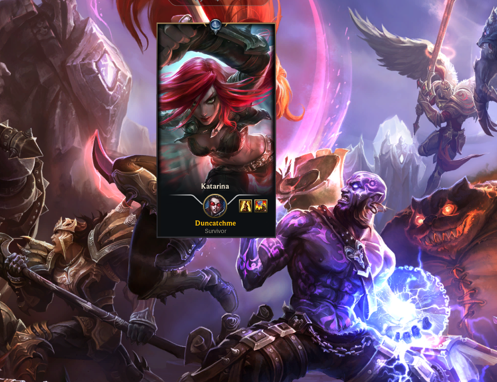
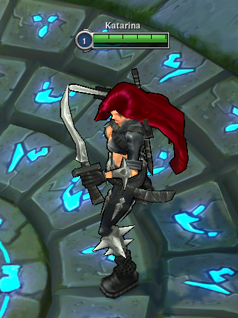
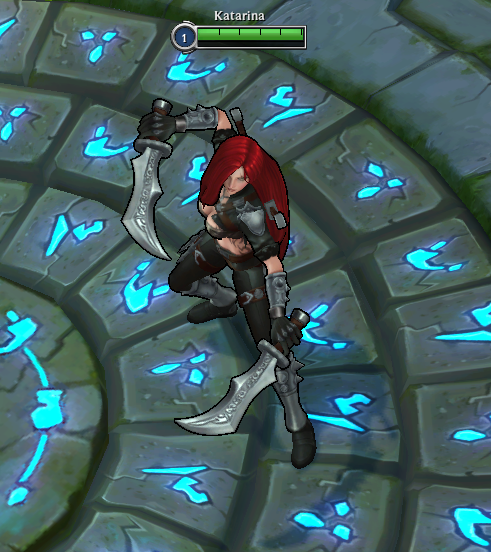

# Riftbound Classic native carriers

## Carrier IDs

Classic skin IDs use the same champion-and-slot structure as regular skin IDs:

```text
full skin ID = champion ID * 1000 + skin slot
```

For Katarina, regular Skin0 is `55000`. Her Classic champion ID is `60055`,
so Classic Skin0 is `60055000`, while her mode-native Skin301 carrier is
`60055301`. The carrier selected in LCU and the target archive selected by
the player are independent values.

## Failure-path evidence: Battle Queen Katarina

Battle Queen Katarina is slot 29, so the client reports the requested Classic
target as `60055029`. To test the fallback rather than the successful archive,
the matching target package was made unavailable before entering a Classic
game and locking Katarina.

The previous universal-Skin0 flow selected `60055000` before injection. The
game still launched, but the missing target left that hidden Skin0 selection
in place. The loading screen showed regular base Katarina, and the in-game
model, textures, and weapons also matched the regular default instead of the
mode-native Classic fallback at `60055301`.



*Figure 1: the game completes loading after the target package is removed,
but the card falls back to regular base Katarina through `60055000`.*



*Figure 2: the expected mode-native Classic fallback provided by Skin301,
whose full LCU ID is `60055301`.*



*Figure 3: the regular default model actually loaded through the hidden
Classic Skin0 ID `60055000` when the target package was unavailable.*

This is a failure-path comparison, not a claim that Skin0 injection is
impossible by design. A Skin0 package can work when all of its model,
animation, weapon, material, and effect files are adapted for that slot. The
native-carrier policy keeps the fallback selected by LCU aligned with the file
layout used by the package when injection cannot complete.

## Runtime discovery

Rose does not use the table below as a hard-coded runtime list. Without the
optional ClassicWheel PR, it resolves the carrier immediately before Rose
writes the injection carrier to LCU. With ClassicWheel installed, the wheel
can publish the carrier it already validated from the same live catalogs; the
injection boundary verifies and reuses that value.

1. Convert the current champion to its Classic ID, for example
   `55 -> 60055`.
2. Read `/lol-champ-select/v1/skin-carousel-skins`.
3. Read
   `/lol-lobby-team-builder/champ-select/v1/pickable-skin-ids`.
4. Keep only IDs for the current Classic champion that occur in both
   responses.
5. Prefer a unique mode-native Skin301 or Skin302 candidate.
6. If multiple native candidates exist, require one unique carousel entry
   marked `isBase` or `isDefault`.
7. If there is no native candidate, use the unique declared default or a
   Skin0 ID that is actually present in both catalogs.
8. If the result is missing or ambiguous, stop Classic injection before
   writing a guessed ID to LCU.

The intersection is important. A Classic-only Skin301 archive can exist in
the library or carousel without being pickable for the current session, and
must not replace a valid Skin0 carrier. Conversely, some mode payloads still
mark a hidden Skin0 card as `isBase`; a unique pickable native slot therefore
takes precedence over that stale marker.

The cached value is accepted only when its champion ID matches the current
Classic champion. A champion exchange therefore forces a fresh lookup without
requiring either PR to own the other's lifecycle hooks.

## Verified carrier snapshot

This is a versioned audit reference, not runtime configuration. The original
60-champion catalog was captured on 2026-08-03. Akali, Kennen, and Shen were
added from the later PBE resource update. Future roster changes should be
accepted through live discovery first and then added here after resource
validation.

### Skin0

| Champion | Carrier ID |
| --- | ---: |
| Olaf | `60002000` |
| Sivir | `60015000` |
| Miss Fortune | `60021000` |
| Ashe | `60022000` |
| Tryndamere | `60023000` |
| Zilean | `60026000` |
| Singed | `60027000` |
| Cho'Gath | `60031000` |
| Amumu | `60032000` |
| Rammus | `60033000` |
| Anivia | `60034000` |
| Shaco | `60035000` |
| Sona | `60037000` |
| Janna | `60040000` |
| Corki | `60042000` |
| Veigar | `60045000` |
| Blitzcrank | `60053000` |
| Malphite | `60054000` |
| Jarvan IV | `60059000` |
| Wukong | `60062000` |
| Brand | `60063000` |
| Vayne | `60067000` |
| Gragas | `60079000` |
| Kennen | `60085000` |
| Leona | `60089000` |
| Malzahar | `60090000` |
| Kog'Maw | `60096000` |
| Lux | `60099000` |
| Lulu | `60117000` |

### Skin301

| Champion | Carrier ID |
| --- | ---: |
| Annie | `60001301` |
| Twisted Fate | `60004301` |
| Fiddlesticks | `60009301` |
| Master Yi | `60011301` |
| Alistar | `60012301` |
| Ryze | `60013301` |
| Sion | `60014301` |
| Soraka | `60016301` |
| Teemo | `60017301` |
| Tristana | `60018301` |
| Warwick | `60019301` |
| Nunu | `60020301` |
| Jax | `60024301` |
| Morgana | `60025301` |
| Evelynn | `60028301` |
| Twitch | `60029301` |
| Karthus | `60030301` |
| Dr. Mundo | `60036301` |
| Kassadin | `60038301` |
| Gangplank | `60041301` |
| Taric | `60044301` |
| Katarina | `60055301` |
| Lee Sin | `60064301` |
| Skarner | `60072301` |
| Heimerdinger | `60074301` |
| Nasus | `60075301` |
| Nidalee | `60076301` |
| Pantheon | `60080301` |
| Ezreal | `60081301` |
| Akali | `60084301` |
| Garen | `60086301` |
| Shen | `60098301` |
| Ahri | `60103301` |

### Skin302

| Champion | Carrier ID |
| --- | ---: |
| Kayle | `60010302` |

## Matching the skin library

The LCU carrier and the root object replaced by a Fantome archive must match.
Do not select Skin301 while installing a Skin0 adapter, or select Skin0 while
installing an archive rooted at Skin301.

- Skin0 champions retain the upstream lightweight packages rooted at
  `Jade_<Champion>/Skins/Skin0`.
- Skin301 and Skin302 champions use carrier-compatible packages rooted at
  their native mode objects.
- Each target skin remains one archive in the existing
  `classic/<Classic champion>/<target skin>` layout. Regular skins use their
  regular IDs, while Classic-only skins use their full Classic IDs. A
  parallel copy of the library for each carrier is not required.
- Package metadata may record the actor, carrier, source skin, and target
  identity for audit purposes, but Rose derives the runtime carrier from LCU,
  not from a filename or a hard-coded champion table.

## Repairing a package for a native carrier

1. Capture the champion's live carousel and pickable catalogs and record the
   verified carrier ID.
2. Locate the official Classic actor, native carrier BIN, and target skin BIN
   in the installed game WADs.
3. Use the native carrier BIN as the package root while preserving the target
   skin identity.
4. Keep every required reference resolvable: model, skeleton, textures,
   materials, animation graph, weapons or dynamic gear, VFX, linked actors,
   audio, and loading-art fields.
5. Include or alias dependencies that are not reliably available through the
   installed client. Multi-actor and dynamic-gear skins require explicit
   per-skin rules.
6. Avoid a carrier BIN that links back to itself, and do not infer a carrier
   from an archive or directory name.
7. Validate the Fantome ZIP, WAD directory, BIN decoding, reference closure,
   carrier/root agreement, and LCU selection before an in-game test.
8. Test both the successful target and the missing-package path. A failure
   must remain on the native Classic default instead of silently selecting a
   hidden Skin0 carrier.

Skin0 conversion remains technically possible if every target dependency is
retargeted correctly. The native-carrier policy is preferred because it keeps
the LCU selection, fallback model, and packaged object graph aligned with the
mode data exposed by the client.
